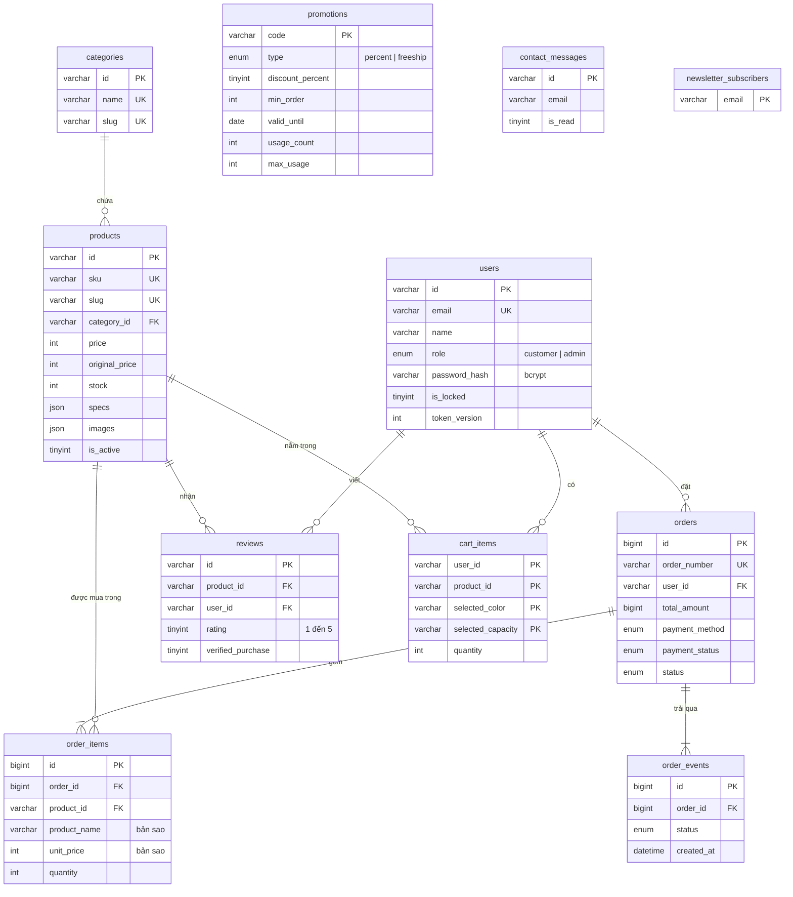

# Cơ sở dữ liệu

MySQL 8, bảng mã `utf8mb4`, engine InnoDB. Cấu trúc được định nghĩa trong
[`server/db/schema.ts`](../server/db/schema.ts) và được tạo tự động khi máy chủ khởi động.

Tệp để nhập thủ công:

| Tệp | Nội dung |
| --- | --- |
| [`database/schema.sql`](../database/schema.sql) | Chỉ cấu trúc bảng |
| [`database/aura_store.sql`](../database/aura_store.sql) | Cấu trúc và dữ liệu mẫu |

## Sơ đồ quan hệ

## Các bảng

| Bảng | Vai trò |
| --- | --- |
| `users` | Khách hàng và quản trị viên, phân biệt bằng `role` |
| `categories` | Danh mục sản phẩm |
| `products` | Sản phẩm. Thông số, tính năng, ảnh và biến thể lưu dạng JSON |
| `promotions` | Mã khuyến mãi, kèm số lượt đã dùng và giới hạn |
| `orders` | Đơn hàng cùng địa chỉ giao và các khoản tiền |
| `order_items` | Dòng sản phẩm của đơn hàng |
| `order_events` | Lịch sử trạng thái của đơn, để hiển thị tiến độ |
| `reviews` | Đánh giá sản phẩm |
| `cart_items` | Giỏ hàng đã lưu của khách đã đăng nhập |
| `contact_messages` | Tin nhắn từ trang Liên hệ |
| `newsletter_subscribers` | Email đăng ký bản tin |

## Các quyết định thiết kế

**Dòng đơn hàng giữ bản sao tên và giá.** `order_items` lưu `product_name`, `product_sku` và
`unit_price` tại thời điểm đặt. Khi sản phẩm đổi giá hoặc bị xóa, đơn cũ vẫn đúng. Khóa ngoại
`product_id` dùng `ON DELETE SET NULL` nên xóa sản phẩm không làm mất đơn hàng.

**Không lưu số liệu suy ra được.** Không có cột điểm đánh giá, lượt bán hay tổng chi tiêu. Chúng
được tính bằng truy vấn con trong `server/db/mappers.ts`, nên không bao giờ lệch khỏi dữ liệu gốc.

**Tiền lưu bằng số nguyên.** VND không có phần lẻ, nên giá dùng `INT UNSIGNED` và tổng tiền dùng
`BIGINT UNSIGNED`, tránh sai số của kiểu số thực.

**`token_version` để hủy phiên.** Giá trị này nằm trong JWT. Khi tài khoản bị khóa hoặc đổi mật
khẩu, giá trị tăng lên và mọi token cũ mất hiệu lực ngay.

**Mỗi khách một đánh giá cho mỗi sản phẩm.** Ràng buộc `UNIQUE (product_id, user_id)` bảo đảm điều
này ở tầng cơ sở dữ liệu, không chỉ ở mã nguồn.

**Khóa dòng khi đặt hàng.** `placeOrder` dùng `SELECT ... FOR UPDATE` trên các sản phẩm của đơn,
theo thứ tự `id` để tránh deadlock, rồi mới kiểm tra và trừ tồn kho.

**Thời gian lưu theo UTC.** Trình duyệt chuyển sang giờ địa phương khi hiển thị.
